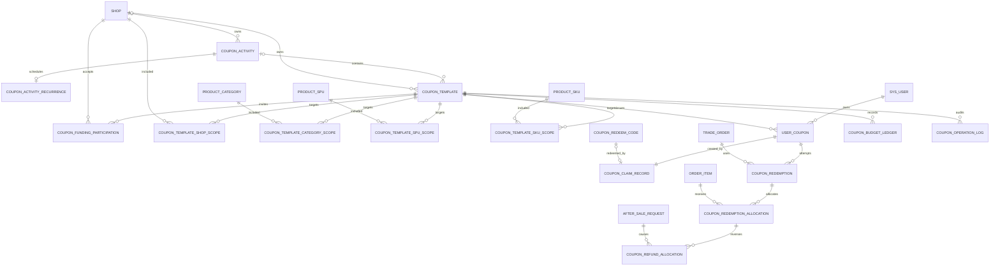

# 时光商城优惠券模块数据库设计

## 1. 文档定位与迁移边界

本文定义优惠券增量模块的数据模型、字段语义、金额约束、状态机、事务边界、并发控制和对账规则。当前迁移按编号顺序执行，本设计不回写已经发布的历史文件。

当前完整执行顺序为：

```text
schema.sql -> schema2.sql -> scheme3.sql -> scheme4.sql -> scheme5.sql
-> scheme6.sql -> scheme7.sql -> scheme8.sql -> scheme9.sql
```

优惠券主体由 `scheme6.sql` 创建，周期抢券规则由 `scheme8.sql` 增加，模板归档状态由 `scheme9.sql` 扩展检查约束。后续迁移必须使用新的递增脚本，不得回写这些已发布文件。

本设计继承：

- [一期数据库设计](phase-1-design.md)中的 ID、金额、时间、外键、历史数据和锁规则；
- [三期数据库设计](phase-3-design.md)中的商家钱包、结算和对象资源边界；
- [优惠券产品需求](../product/coupon-requirements.md)中的券种、叠加、返券和用户体验规则；
- [优惠券 API 设计](../api/coupon-api.md)中的外部字段、状态和错误语义。

如本文与旧数据库文档在“优惠后订单金额”上存在差异，仅在优惠券主体迁移 `scheme6.sql` 成功安装后使用本文第 12 节的新公式；历史无券交易通过 `coupon_discount_amount=0.00` 保持原等式。

## 2. 设计原则

1. 券模板、用户券、活动库存、商品库存、核销和营销预算分别建模，禁止复用同一状态或数量字段。
2. 订单创建时固化优惠和资金承担分摊；支付、退款和商家结算只读取快照，不重新运行当前券规则。
3. 券模板第一张用户券产生后经济字段不可修改；历史引用不级联删除。
4. Redis 只做限流、热点缓存、报价 Token 和任务锁；MySQL 是发行量、用户券状态、核销和金额的最终事实。
5. 金额均为 `DECIMAL(18,2)` 元；费率使用 `DECIMAL(7,4)` 的百分比数，不使用浮点数。
6. 多态适用范围使用独立关系表，保留商品、店铺和类目的外键完整性，不把目标 ID 列表塞入 JSON。
7. 所有业务编号、领取业务键、核销尝试和预算流水具有数据库唯一保护。

## 3. 核心关系



优惠券新增 16 张表：

1. `coupon_activity`
2. `coupon_template`
3. `coupon_template_shop_scope`
4. `coupon_template_category_scope`
5. `coupon_template_spu_scope`
6. `coupon_template_sku_scope`
7. `coupon_funding_participation`
8. `user_coupon`
9. `coupon_claim_record`
10. `coupon_redeem_code`
11. `coupon_redemption`
12. `coupon_redemption_allocation`
13. `coupon_refund_allocation`
14. `coupon_budget_ledger`
15. `coupon_operation_log`
16. `coupon_activity_recurrence`

范围关系刻意拆成 4 张，以换取外键和清晰的数据范围。本文后续如称“优惠券表”，均包含这 16 张增量表。

## 4. 活动与券模板

### 4.1 `coupon_activity`

活动负责展示、时间窗和多模板组织，不保存用户券状态或订单金额。

| 字段 | 类型与空值 | 含义 |
| --- | --- | --- |
| `id` | `BIGINT UNSIGNED`，主键，自增 | 活动 ID，应用只接受 `Long.MAX_VALUE` 范围 |
| `activity_no` | `VARCHAR(64)`，非空，唯一 | 活动编号，前缀建议 `CA` |
| `owner_type` | `VARCHAR(16)`，非空 | `PLATFORM`、`SHOP` |
| `shop_id` | `BIGINT UNSIGNED`，条件可空，外键 | `SHOP` 时必填，`PLATFORM` 时为空 |
| `activity_type` | `VARCHAR(32)`，非空 | `COUPON_CENTER`、`FLASH_CLAIM`、`NEW_USER_WELCOME`、`TARGETED_CAMPAIGN` |
| `activity_name` | `VARCHAR(128)`，非空 | 用户可见名称，trim 后 `1..128` |
| `subtitle` | `VARCHAR(255)`，可空 | 用户可见副标题 |
| `banner_url` | `VARCHAR(1024)`，可空 | 活动横幅；遵循图片 URL 安全规则 |
| `starts_at`、`ends_at` | `DATETIME(3)`，非空 | 一次性活动为唯一窗口；周期活动分别物化第一个有效窗口开始和最后一个有效窗口结束 |
| `status` | `VARCHAR(20)`，非空，默认 `DRAFT` | `DRAFT`、`SCHEDULED`、`RUNNING`、`PAUSED`、`ENDED`、`CANCELLED` |
| `pause_source` | `VARCHAR(16)`，可空 | `OWNER` 或 `PLATFORM_GOVERNANCE` |
| `pause_reason` | `VARCHAR(500)`，可空 | `PAUSED` 时必填 |
| `created_by`、`updated_by` | `BIGINT UNSIGNED`，非空，外键 | 创建和最后修改操作者 |
| `version` | `INT UNSIGNED`，非空，默认 `0` | 乐观锁版本 |
| `created_at`、`updated_at` | `DATETIME(3)`，非空 | 审计时间 |

主要约束与索引：

- `owner_type='SHOP'` 当且仅当 `shop_id IS NOT NULL`。
- `ends_at > starts_at`。
- 只有 `PAUSED` 可填写 `pause_source/pause_reason`；其他状态两者为空。
- `(shop_id, status, starts_at)`、`(owner_type, status, starts_at)` 和 `(status, ends_at)` 建索引。
- 活动和模板有历史引用后不得物理删除；草稿删除也建议使用 `CANCELLED` 保留操作轨迹。

### 4.2 `coupon_activity_recurrence`

周期规则与活动一对零或一，只有周期活动存在记录；一次性活动仍只使用 `coupon_activity.starts_at/ends_at`。

| 字段 | 类型与空值 | 含义 |
| --- | --- | --- |
| `activity_id` | `BIGINT UNSIGNED`，主键、外键 | 关联活动，一项活动最多一条规则 |
| `recurrence_type` | `VARCHAR(16)`，非空 | `DAILY`、`WEEKLY`、`MONTHLY` |
| `weekdays_json` | `JSON`，条件可空 | 周规则 ISO 星期数组 `1..7` |
| `month_days_json` | `JSON`，条件可空 | 月规则日期数组 `1..31` |
| `daily_starts_at` | `TIME`，非空 | 每个有效日期的开抢时刻，秒固定为 `00` |
| `window_duration_minutes` | `INT`，非空 | 每场 `1..1440` 分钟 |
| `recurrence_starts_at`、`recurrence_ends_at` | `DATETIME(3)`，非空 | 周期生效范围，最长 366 天，由应用校验 |
| `timezone` | `VARCHAR(64)`，非空 | 固定 `Asia/Shanghai` |
| `created_at`、`updated_at` | `DATETIME(3)`，非空 | 审计时间 |

组合约束要求每天规则的两个数组都为空，每周只允许 `weekdays_json`，每月只允许 `month_days_json`。数组值域、去重、排序、月末缺失日期跳过和至少存在一个完整窗口由应用服务统一校验。迁移位于 `sql/scheme8.sql`。

### 4.3 `coupon_template`

一行代表一组不可分割的经济规则。模板开始发行后只允许修改展示文案、排序和增加总发行量/预算，不允许改变已承诺权益。

| 字段 | 类型与空值 | 含义 |
| --- | --- | --- |
| `id` | `BIGINT UNSIGNED`，主键，自增 | 模板 ID |
| `template_no` | `VARCHAR(64)`，非空，唯一 | 模板业务编号，前缀建议 `CT` |
| `activity_id` | `BIGINT UNSIGNED`，可空，外键 | 所属活动；定向、系统或兑换码发券可不属于活动 |
| `owner_type` | `VARCHAR(16)`，非空 | `PLATFORM`、`SHOP`，必须与活动归属一致 |
| `owner_shop_id` | `BIGINT UNSIGNED`，条件可空，外键 | 店铺券归属；平台券为空 |
| `coupon_name` | `VARCHAR(128)`，非空 | 用户可见券名 |
| `description` | `VARCHAR(500)`，可空 | 使用说明，不允许承诺数据库规则之外的权益 |
| `coupon_type` | `VARCHAR(32)`，非空 | `PERCENTAGE`、`THRESHOLD_REDUCTION`、`CASH_RED_PACKET` |
| `threshold_amount` | `DECIMAL(18,2)`，非空 | 适用商品原始金额门槛 |
| `discount_amount` | `DECIMAL(18,2)`，可空 | 固定满减/红包金额 |
| `percentage_off` | `DECIMAL(5,2)`，可空 | 减免百分比；`10.00` 表示减 10% |
| `maximum_discount_amount` | `DECIMAL(18,2)`，可空 | 百分比券最高减免额 |
| `funding_type` | `VARCHAR(16)`，非空 | `PLATFORM`、`SHOP`、`SHARED` |
| `platform_share_rate` | `DECIMAL(7,4)`，非空，默认 `0.0000` | 平台承担百分比；平台全额为 `100.0000` |
| `scope_type` | `VARCHAR(16)`，非空 | `ALL`、`SHOP`、`CATEGORY`、`SPU`、`SKU` |
| `distribution_type` | `VARCHAR(24)`，非空 | `PUBLIC_CLAIM`、`FLASH_CLAIM`、`REDEEM_CODE`、`DIRECT_GRANT`、`SYSTEM_GRANT` |
| `audience_type` | `VARCHAR(24)`，非空 | `ALL_USERS`、`NEW_USERS`、`FIRST_ORDER_USERS`、`SPECIFIED_USERS` |
| `new_user_within_days` | `INT UNSIGNED`，条件可空 | `NEW_USERS` 时必填，范围 `1..365` |
| `claim_starts_at`、`claim_ends_at` | `DATETIME(3)`，条件可空 | 公开/抢券领取窗；其他发放方式为空 |
| `validity_type` | `VARCHAR(24)`，非空 | `FIXED_RANGE`、`RELATIVE_AFTER_CLAIM` |
| `valid_from`、`valid_to` | `DATETIME(3)`，条件可空 | 固定有效期 |
| `effective_delay_minutes` | `INT UNSIGNED`，条件可空 | 相对有效期延迟，`0..10080` |
| `valid_for_hours` | `INT UNSIGNED`，条件可空 | 相对有效时长，`1..8760` |
| `total_issue_limit` | `INT UNSIGNED`，非空 | 总发行量，必须大于 0 |
| `issued_count` | `INT UNSIGNED`，非空，默认 `0` | 已创建用户券数量，只增不减 |
| `per_user_limit` | `TINYINT UNSIGNED`，非空，默认 `1` | 每用户最多 `1..99` 张 |
| `stack_mode` | `VARCHAR(20)`，非空 | `EXCLUSIVE`、`CROSS_OWNER` |
| `refund_restore_policy` | `VARCHAR(24)`，非空 | `NEVER`、`FULL_TRADE_ONLY` |
| `budget_amount` | `DECIMAL(18,2)`，非空 | 模板最大优惠责任预算 |
| `budget_reserved_amount` | `DECIMAL(18,2)`，非空，默认 `0.00` | 已发行未最终消耗用户券的当前最大责任预占 |
| `budget_consumed_amount` | `DECIMAL(18,2)`，非空，默认 `0.00` | 支付核销产生的累计实际优惠 |
| `budget_reversed_amount` | `DECIMAL(18,2)`，非空，默认 `0.00` | 全额退款冲回的累计实际优惠 |
| `status` | `VARCHAR(20)`，非空，默认 `DRAFT` | `DRAFT`、`ACTIVE`、`PAUSED`、`ENDED`、`ARCHIVED` |
| `first_issued_at` | `DATETIME(3)`，可空 | 第一张用户券创建时间；非空后经济字段冻结 |
| `sort_order` | `INT`，非空，默认 `0` | 活动内排序，越小越靠前 |
| `created_by`、`updated_by` | `BIGINT UNSIGNED`，非空，外键 | 操作者 |
| `version` | `INT UNSIGNED`，非空，默认 `0` | 乐观锁和计数更新版本 |
| `created_at`、`updated_at` | `DATETIME(3)`，非空 | 审计时间 |

`ARCHIVED` 表示从默认管理列表隐藏但继续保留历史业务事实，只允许 `DRAFT/ENDED -> ARCHIVED`。它不是逻辑删除标记，不使用全局查询拦截器；用户券使用、退款返券、预算和对账仍需读取归档模板及范围。迁移 `scheme9.sql` 只替换 `chk_coupon_template_status`，不回写历史状态。

券种 `CHECK`：

```text
PERCENTAGE:
  threshold_amount >= 0
  discount_amount IS NULL
  percentage_off BETWEEN 0.01 AND 99.99
  maximum_discount_amount > 0

THRESHOLD_REDUCTION:
  threshold_amount > 0
  discount_amount > 0 AND discount_amount < threshold_amount
  percentage_off IS NULL
  maximum_discount_amount IS NULL

CASH_RED_PACKET:
  threshold_amount = 0
  discount_amount > 0
  percentage_off IS NULL
  maximum_discount_amount IS NULL
```

资金 `CHECK`：

```text
funding_type = PLATFORM -> platform_share_rate = 100.0000
funding_type = SHOP     -> platform_share_rate = 0.0000
funding_type = SHARED   -> 0.0001 <= platform_share_rate <= 99.9999
owner_type = SHOP       -> funding_type = SHOP
funding_type = SHARED   -> owner_type = PLATFORM
```

`SHARED` 只允许 `scope_type=SHOP|SPU|SKU`，使所有承担成本的店铺在模板激活前可被完整枚举并逐店确认；`ALL` 和 `CATEGORY` 范围不得使用联合承担。

有效期 `CHECK`：固定模式只允许固定时间字段；相对模式只允许延迟和时长字段。公开领取和限时抢券必须有领取时间窗，其他发放方式不得填写公开领取窗。

发放方式跨字段约束：

~~~text
PUBLIC_CLAIM/FLASH_CLAIM -> activity_id IS NOT NULL
FLASH_CLAIM              -> activity.activity_type = FLASH_CLAIM
SYSTEM_GRANT             -> owner_type = PLATFORM
                            AND audience_type = NEW_USERS
SPECIFIED_USERS           -> distribution_type = DIRECT_GRANT
~~~

活动类型和模板归属属于跨表规则，在模板激活事务中校验；不能只依赖单表 `CHECK`。

预算规则：

```text
maxLiabilityPerCoupon =
  PERCENTAGE ? maximum_discount_amount : discount_amount

budget_amount >= total_issue_limit * maxLiabilityPerCoupon
budget_reserved_amount >= 0
budget_consumed_amount >= budget_reversed_amount >= 0
budget_reserved_amount + budget_consumed_amount - budget_reversed_amount <= budget_amount
issued_count <= total_issue_limit
```

`budget_amount` 和 `total_issue_limit` 开始发行后只允许增加。该最坏责任模型保证用户成功领取后不会在结算时因运营预算耗尽而突然不可用。

主要索引：

- `(activity_id, status, sort_order, id)`；
- `(owner_shop_id, status, created_at)`；
- `(owner_type, status, claim_starts_at, claim_ends_at)`；
- `(distribution_type, status, claim_ends_at)`；
- `template_no` 唯一。

## 5. 适用范围关系表

### 5.1 `coupon_template_shop_scope`

仅用于平台券 `scope_type=SHOP`。

| 字段 | 类型与空值 | 含义 |
| --- | --- | --- |
| `template_id` | `BIGINT UNSIGNED`，复合主键，外键 | 券模板 |
| `shop_id` | `BIGINT UNSIGNED`，复合主键，外键 | 目标店铺 |
| `created_at` | `DATETIME(3)`，非空 | 添加时间 |

主键 `(template_id, shop_id)`。应用必须确认模板为平台券且目标店铺创建时存在；店铺之后暂停不会删除关系。

### 5.2 `coupon_template_category_scope`

| 字段 | 类型与空值 | 含义 |
| --- | --- | --- |
| `template_id` | `BIGINT UNSIGNED`，复合主键，外键 | 券模板 |
| `category_id` | `BIGINT UNSIGNED`，复合主键，外键 | 目标类目根节点 |
| `created_at` | `DATETIME(3)`，非空 | 添加时间 |

主键 `(template_id, category_id)`。运行时命中目标类目及其启用后代。重复选择祖先和后代不会增加优惠范围，草稿保存时应规范化为最小不重复根集合。

### 5.3 `coupon_template_spu_scope`

| 字段 | 类型与空值 | 含义 |
| --- | --- | --- |
| `template_id` | `BIGINT UNSIGNED`，复合主键，外键 | 券模板 |
| `spu_id` | `BIGINT UNSIGNED`，复合主键组成 | 目标 SPU |
| `shop_id` | `BIGINT UNSIGNED`，非空 | SPU 店铺快照，参与复合外键 |
| `created_at` | `DATETIME(3)`，非空 | 添加时间 |

主键 `(template_id, spu_id)`；`FOREIGN KEY (spu_id, shop_id) REFERENCES product_spu(id, shop_id)`。店铺券的每个 `shop_id` 必须等于模板 `owner_shop_id`。

### 5.4 `coupon_template_sku_scope`

| 字段 | 类型与空值 | 含义 |
| --- | --- | --- |
| `template_id` | `BIGINT UNSIGNED`，复合主键，外键 | 券模板 |
| `sku_id` | `BIGINT UNSIGNED`，复合主键组成 | 目标 SKU |
| `spu_id`、`shop_id` | `BIGINT UNSIGNED`，非空 | SKU 归属，参与复合外键 |
| `created_at` | `DATETIME(3)`，非空 | 添加时间 |

主键 `(template_id, sku_id)`；复合外键到 `product_sku(id, spu_id, shop_id)`。店铺券目标必须属于模板店铺。

### 5.5 范围完整性

数据库外键保证目标存在，应用还必须保证：

```text
scope_type = ALL      -> 四张范围表均无记录
scope_type = SHOP     -> shop_scope 至少一条，其他三张为空
scope_type = CATEGORY -> category_scope 至少一条，其他三张为空
scope_type = SPU      -> spu_scope 至少一条，其他三张为空
scope_type = SKU      -> sku_scope 至少一条，其他三张为空
```

该跨表数量规则在模板激活事务中检查。模板第一次发行后范围表禁止增删。

## 6. 联合承担参与关系

### 6.1 `coupon_funding_participation`

平台不能单方面让商家承担联合活动成本。每个可能承担 `SHARED` 优惠的店铺必须存在一条明确接受记录。

| 字段 | 类型与空值 | 含义 |
| --- | --- | --- |
| `id` | `BIGINT UNSIGNED`，主键，自增 | 参与关系 ID |
| `template_id` | `BIGINT UNSIGNED`，非空，外键 | 平台联合承担模板 |
| `shop_id` | `BIGINT UNSIGNED`，非空，外键 | 被邀请店铺 |
| `platform_share_rate` | `DECIMAL(7,4)`，非空 | 邀请时平台承担比例快照，必须等于模板当前值 |
| `status` | `VARCHAR(16)`，非空，默认 `PENDING` | `PENDING`、`ACCEPTED`、`REJECTED`、`CANCELLED` |
| `invited_by` | `BIGINT UNSIGNED`，非空，外键 | 平台邀请操作者 |
| `decided_by` | `BIGINT UNSIGNED`，可空，外键 | 接受/拒绝的店铺成员 |
| `decision_reason` | `VARCHAR(500)`，可空 | 拒绝必填，接受可空 |
| `invited_at` | `DATETIME(3)`，非空 | 邀请时间 |
| `decided_at` | `DATETIME(3)`，可空 | 决定时间 |
| `version` | `INT UNSIGNED`，非空，默认 `0` | 并发版本 |
| `created_at`、`updated_at` | `DATETIME(3)`，非空 | 审计时间 |

唯一键 `(template_id, shop_id)`。状态完整性：

- `PENDING` 没有决定字段；
- `ACCEPTED/REJECTED` 必须有决定人和时间，`REJECTED` 还必须有原因；
- `CANCELLED` 只允许平台在模板发行前取消邀请；
- 决定人必须是该店当时有效且拥有 `shop:coupon:funding:approve` 的成员。

模板激活前，应用从 `SHOP/SPU/SKU` 范围求出全部目标店铺，要求参与关系集合完全相等且全部为 `ACCEPTED`。模板范围或 `platform_share_rate` 在草稿期变化时，原接受结果全部失效并重置为新的 `PENDING` 邀请；第一张券发行后参与关系不可撤销或改比例。

## 7. 用户券与领取

### 7.1 `user_coupon`

每行是一张用户实际持有的券。用户券不物理删除。

| 字段 | 类型与空值 | 含义 |
| --- | --- | --- |
| `id` | `BIGINT UNSIGNED`，主键，自增 | 用户券 ID |
| `coupon_no` | `VARCHAR(64)`，非空，唯一 | 用户券号，前缀建议 `UC` |
| `template_id` | `BIGINT UNSIGNED`，非空，外键 | 来源模板 |
| `template_version` | `INT UNSIGNED`，非空 | 发行时模板版本，用于审计 |
| `user_id` | `BIGINT UNSIGNED`，非空，外键 | 所属用户 |
| `status` | `VARCHAR(16)`，非空，默认 `AVAILABLE` | `AVAILABLE`、`LOCKED`、`USED`、`EXPIRED`、`REVOKED` |
| `valid_from`、`valid_to` | `DATETIME(3)`，非空 | 固化有效区间 `[from,to)` |
| `locked_trade_id` | `BIGINT UNSIGNED`，可空，外键 | `LOCKED` 时唯一关联待支付父交易 |
| `used_at` | `DATETIME(3)`，可空 | 最近一次成功支付核销时间 |
| `expired_at` | `DATETIME(3)`，可空 | 状态物化为 `EXPIRED` 的时间 |
| `revoked_by` | `BIGINT UNSIGNED`，可空，外键 | 撤销操作者 |
| `revoked_reason` | `VARCHAR(500)`，可空 | 撤销原因 |
| `revoked_at` | `DATETIME(3)`，可空 | 撤销时间 |
| `restore_count` | `TINYINT UNSIGNED`，非空，默认 `0` | 全额退款返券次数，只允许 `0` 或 `1` |
| `last_restored_at` | `DATETIME(3)`，可空 | 最近返券时间 |
| `version` | `INT UNSIGNED`，非空，默认 `0` | 状态乐观锁版本 |
| `created_at`、`updated_at` | `DATETIME(3)`，非空 | 领取/发放和更新时间 |

主要约束：

- `valid_to > valid_from`，`restore_count IN (0,1)`。
- `LOCKED` 当且仅当 `locked_trade_id IS NOT NULL`；其他状态必须为空。
- `USED` 要求 `used_at IS NOT NULL`；返券后状态回到 `AVAILABLE`，保留 `used_at` 作为历史最近核销时间。
- `REVOKED` 要求完整撤销字段；其他状态撤销字段为空。
- `(user_id, status, valid_to, id)` 支持“我的券”和结算候选查询。
- `(template_id, user_id, created_at)` 支持每用户限领计数；限领仍需在模板锁内复核。

实时过期判定优先于物化状态：`status=AVAILABLE AND valid_to <= now` 在业务上视为 `EXPIRED`，即使任务尚未更新行。

已在有效期内创建交易的 `LOCKED` 券允许在该父交易 `pay_expire_at` 前完成支付，即使支付时已超过券 `valid_to`；它不能用于新交易。取消时若已过 `valid_to`，状态直接转为 `EXPIRED`。

### 7.2 `coupon_claim_record`

只记录成功产生用户券的领取/发放事实；失败尝试进入受控日志和指标，不写无限增长的失败业务表。

| 字段 | 类型与空值 | 含义 |
| --- | --- | --- |
| `id` | `BIGINT UNSIGNED`，主键，自增 | 领取记录 ID |
| `claim_no` | `VARCHAR(64)`，非空，唯一 | 领取编号，前缀建议 `CC` |
| `user_coupon_id` | `BIGINT UNSIGNED`，非空，唯一，外键 | 产生的用户券 |
| `template_id`、`user_id` | `BIGINT UNSIGNED`，非空，外键 | 模板和用户冗余归属，用于审计查询 |
| `activity_id` | `BIGINT UNSIGNED`，可空，外键 | 来源活动 |
| `claim_source` | `VARCHAR(24)`，非空 | 与模板发放方式相同的稳定代码 |
| `redeem_code_id` | `BIGINT UNSIGNED`，可空，外键 | 兑换码发放时关联 |
| `granted_by` | `BIGINT UNSIGNED`，可空，外键 | 定向人工发放操作者；用户领取/系统发放为空 |
| `business_no` | `VARCHAR(128)`，非空，唯一 | 数据库幂等业务键，由用户、模板、接口 Key 派生 |
| `created_at` | `DATETIME(3)`，非空 | 成功时间 |

`claim_source=REDEEM_CODE` 才允许 `redeem_code_id`；`DIRECT_GRANT` 才允许 `granted_by`。同一 `business_no` 只能产生一条领取记录。

`claim_source=SYSTEM_GRANT` 时 `redeem_code_id` 和 `granted_by` 必须为空，`business_no` 固定使用
`SYSTEM_GRANT:USER_REGISTERED:{userId}:{templateId}`。该业务键同时覆盖注册事件重投、定时补偿扫描和服务重启重试。

### 7.3 `coupon_redeem_code`

| 字段 | 类型与空值 | 含义 |
| --- | --- | --- |
| `id` | `BIGINT UNSIGNED`，主键，自增 | 兑换码 ID |
| `batch_no` | `VARCHAR(64)`，非空 | 批次号，同批代码共享 |
| `template_id` | `BIGINT UNSIGNED`，非空，外键 | 必须为 `REDEEM_CODE` 模板 |
| `code_hash` | `CHAR(64)`，ASCII 二进制排序，非空，唯一 | `HMAC-SHA-256(serverSecret, normalizedCode)` 小写摘要 |
| `hash_key_version` | `SMALLINT UNSIGNED`，非空 | 服务端 HMAC 密钥版本，用于安全轮换和历史代码查找 |
| `status` | `VARCHAR(16)`，非空 | `ACTIVE`、`REDEEMED`、`REVOKED` |
| `user_coupon_id` | `BIGINT UNSIGNED`，可空，唯一，外键 | 兑换成功产生的用户券 |
| `redeemed_by` | `BIGINT UNSIGNED`，可空，外键 | 兑换用户 |
| `redeemed_at` | `DATETIME(3)`，可空 | 兑换时间 |
| `revoked_by`、`revoked_at`、`revoke_reason` | 条件可空 | 未兑换代码撤销审计 |
| `created_by` | `BIGINT UNSIGNED`，非空，外键 | 批次创建人 |
| `created_at` | `DATETIME(3)`，非空 | 生成时间 |

数据库不保存明文或 HMAC 密钥。服务端按仍在支持期的密钥版本计算候选摘要并通过唯一索引查找，比较使用恒定时间函数；密钥轮换前必须保留尚未到期代码所需的旧版本密钥。`REDEEMED` 要求用户券、用户和时间完整；`REVOKED` 要求撤销审计完整；`ACTIVE` 时这些结果字段均为空。

## 8. 核销与金额分摊

### 8.1 `coupon_redemption`

一张用户券每次尝试使用产生一条记录。退款返券后再次使用会产生下一 `attempt_no`，不会覆盖第一次历史。

| 字段 | 类型与空值 | 含义 |
| --- | --- | --- |
| `id` | `BIGINT UNSIGNED`，主键，自增 | 核销记录 ID |
| `redemption_no` | `VARCHAR(64)`，非空，唯一 | 核销编号，前缀建议 `CR` |
| `user_coupon_id` | `BIGINT UNSIGNED`，非空，外键 | 被使用用户券 |
| `template_id`、`user_id` | `BIGINT UNSIGNED`，非空，外键 | 模板和券主快照 |
| `trade_id` | `BIGINT UNSIGNED`，非空，外键 | 关联父交易 |
| `attempt_no` | `TINYINT UNSIGNED`，非空 | 从 1 开始；当前最大 2 |
| `status` | `VARCHAR(16)`，非空 | `RESERVED`、`CONSUMED`、`RELEASED`、`RESTORED` |
| `discount_amount` | `DECIMAL(18,2)`，非空 | 本次总优惠，必须大于 0 |
| `platform_funded_amount` | `DECIMAL(18,2)`，非空 | 平台承担 |
| `shop_funded_amount` | `DECIMAL(18,2)`，非空 | 商家承担 |
| `reserved_at` | `DATETIME(3)`，非空 | 创建父交易时间 |
| `consumed_at`、`released_at`、`restored_at` | 条件可空 | 对应终态时间 |
| `release_reason` | `VARCHAR(32)`，可空 | `USER_CANCEL`、`TRADE_TIMEOUT`、`SYSTEM_RECOVERY` |
| `version` | `INT UNSIGNED`，非空，默认 `0` | 状态并发版本 |
| `created_at`、`updated_at` | `DATETIME(3)`，非空 | 审计时间 |
| `active_coupon_id` | 生成列，可空 | `RESERVED`/`CONSUMED` 时等于 `user_coupon_id`，否则为空 |

约束和唯一键：

- `discount_amount = platform_funded_amount + shop_funded_amount`。
- `UNIQUE(user_coupon_id, attempt_no)`。
- `UNIQUE(trade_id, user_coupon_id)`。
- `UNIQUE(active_coupon_id)` 保证一张券最多一个未释放/未返还的有效核销。
- `RESERVED` 只有 `reserved_at`；`CONSUMED` 增加 `consumed_at`；`RELEASED` 必须有释放时间/原因；`RESTORED` 必须先有 `consumed_at` 再有 `restored_at`。
- `attempt_no=2` 只允许用户券 `restore_count=1` 后创建。

### 8.2 `coupon_redemption_allocation`

每行表示一张券在一条订单明细上的精确优惠和资金承担。创建后不可更新、不可删除。

| 字段 | 类型与空值 | 含义 |
| --- | --- | --- |
| `id` | `BIGINT UNSIGNED`，主键，自增 | 分摊 ID |
| `redemption_id` | `BIGINT UNSIGNED`，非空，外键 | 核销记录 |
| `trade_id` | `BIGINT UNSIGNED`，非空，外键 | 父交易冗余范围 |
| `order_id` | `BIGINT UNSIGNED`，非空 | 子订单 |
| `order_item_id` | `BIGINT UNSIGNED`，非空 | 订单明细 |
| `shop_id` | `BIGINT UNSIGNED`，非空 | 明细店铺 |
| `eligible_gross_amount` | `DECIMAL(18,2)`，非空 | 本券命中的该明细原始商品金额 |
| `calculation_base_amount` | `DECIMAL(18,2)`，非空 | 扣除先应用店铺券后，实际用于本券计算/分摊的基数 |
| `discount_amount` | `DECIMAL(18,2)`，非空 | 分摊到该明细的优惠 |
| `platform_funded_amount` | `DECIMAL(18,2)`，非空 | 平台承担分摊 |
| `shop_funded_amount` | `DECIMAL(18,2)`，非空 | 商家承担分摊 |
| `created_at` | `DATETIME(3)`，非空 | 下单时间 |

外键：

- `(order_id, shop_id) -> order_info(id, shop_id)`；
- `(order_item_id, order_id) -> order_item(id, order_id)`。

唯一键 `(redemption_id, order_item_id)`。金额要求：

```text
eligible_gross_amount > 0
calculation_base_amount > 0
discount_amount > 0
discount_amount = platform_funded_amount + shop_funded_amount
discount_amount <= calculation_base_amount

SUM(allocation.discount_amount by redemption) = coupon_redemption.discount_amount
SUM(allocation.platform_funded_amount) = redemption.platform_funded_amount
SUM(allocation.shop_funded_amount) = redemption.shop_funded_amount
```

后三个跨行等式由下单事务保证，并由每日对账复核。

### 8.3 `coupon_refund_allocation`

记录每次成功钱包退款对原优惠分摊和平台补贴的冲回。它不改变买家退款金额，只提供精确财务审计。

| 字段 | 类型与空值 | 含义 |
| --- | --- | --- |
| `id` | `BIGINT UNSIGNED`，主键，自增 | 退款分摊 ID |
| `redemption_allocation_id` | `BIGINT UNSIGNED`，非空，外键 | 原核销明细分摊 |
| `after_sale_id` | `BIGINT UNSIGNED`，非空，外键 | 售后申请 |
| `refund_no` | `VARCHAR(64)`，非空 | 既有售后退款号 |
| `refunded_quantity` | `INT UNSIGNED`，非空 | 本次成功退款数量 |
| `coupon_discount_reversal_amount` | `DECIMAL(18,2)`，非空 | 本次退款按数量比例冲回的该券优惠成本 |
| `platform_funding_reversal_amount` | `DECIMAL(18,2)`，非空 | 按原分摊冲回的平台补贴 |
| `shop_funding_reversal_amount` | `DECIMAL(18,2)`，非空 | 按原分摊冲回的商家营销让利效果 |
| `created_at` | `DATETIME(3)`，非空 | 退款成功时间 |

唯一键 `(redemption_allocation_id, refund_no)` 防止退款重试重复冲回。金额必须满足：

~~~text
coupon_discount_reversal_amount
  = platform_funding_reversal_amount + shop_funding_reversal_amount
~~~

累计优惠、平台和商家冲回分别不得超过原分摊对应金额；最后一笔全量退款吸收分摊尾差。买家实际退款仍以 `after_sale_request.approved_amount` 和既有钱包流水为准，不在每张券的退款分摊中重复保存，否则一条明细叠加两张券时会重复统计同一笔买家退款。

## 9. 预算流水与操作审计

### 9.1 `coupon_budget_ledger`

模板上的预算字段是聚合值；所有变化必须同时写不可变流水。

| 字段 | 类型与空值 | 含义 |
| --- | --- | --- |
| `id` | `BIGINT UNSIGNED`，主键，自增 | 流水 ID |
| `ledger_no` | `VARCHAR(64)`，非空，唯一 | 流水编号，前缀建议 `CBL` |
| `template_id` | `BIGINT UNSIGNED`，非空，外键 | 券模板 |
| `user_coupon_id` | `BIGINT UNSIGNED`，可空，外键 | 关联用户券 |
| `redemption_id` | `BIGINT UNSIGNED`，可空，外键 | 关联核销 |
| `entry_type` | `VARCHAR(24)`，非空 | 见下表 |
| `reserved_change` | `DECIMAL(18,2)`，非空 | 当前责任预占变化，可正可负 |
| `consumed_change` | `DECIMAL(18,2)`，非空 | 累计实际使用变化，通常非负 |
| `reversed_change` | `DECIMAL(18,2)`，非空 | 累计退款冲回变化，通常非负 |
| `reserved_after`、`consumed_after`、`reversed_after` | `DECIMAL(18,2)`，非空 | 变化后模板聚合快照 |
| `platform_amount`、`shop_amount` | `DECIMAL(18,2)`，非空 | 本业务动作的资金承担；基数随 `entry_type` 定义 |
| `business_type` | `VARCHAR(32)`，非空 | `COUPON_CLAIM`、`COUPON_REDEMPTION`、`COUPON_REFUND` 等 |
| `business_no` | `VARCHAR(128)`，非空 | 幂等业务号 |
| `created_at` | `DATETIME(3)`，非空 | 时间 |

唯一键 `(entry_type, business_type, business_no)`。

| `entryType` | 聚合变化 | 场景 |
| --- | --- | --- |
| `CLAIM_RESERVE` | `reserved + maxLiability` | 成功领取/发放 |
| `USE_CONSUME` | `reserved - maxLiability`，`consumed + actualDiscount` | 支付核销；最大责任与实际差额自然释放 |
| `EXPIRE_RELEASE` | `reserved - maxLiability` | 未使用券过期 |
| `REVOKE_RELEASE` | `reserved - maxLiability` | 未使用券撤销 |
| `REFUND_REVERSE` | `reversed + actualDiscount` | 成功全量/部分退款按优惠成本冲回 |
| `RESTORE_RESERVE` | `reserved + maxLiability` | 全父交易退款且返券 |

特别说明：用户券从 `LOCKED -> AVAILABLE` 的未支付取消不释放模板预算，因为同一用户券仍然存在并可再次使用；只有用户券最终 `EXPIRED` 或 `REVOKED` 才释放最大责任预占。

`CLAIM_RESERVE/EXPIRE_RELEASE/REVOKE_RELEASE/RESTORE_RESERVE` 的平台与商家金额之和等于 `maxLiability`；`USE_CONSUME` 等于本次实际优惠；`REFUND_REVERSE` 等于本次优惠成本冲回。不要把 `USE_CONSUME` 中“释放最大责任”和“增加实际消耗”相加后当作营销成本。

预算“实际冲回”按成功退款对应的原优惠比例累计；`REFUND_REVERSE` 可发生于部分退款，即使不返券。返券仅额外产生 `RESTORE_RESERVE`。

### 9.2 `coupon_operation_log`

保存经济规则、展示字段、状态和治理动作的不可变审计。

| 字段 | 类型与空值 | 含义 |
| --- | --- | --- |
| `id` | `BIGINT UNSIGNED`，主键，自增 | 日志 ID |
| `resource_type` | `VARCHAR(24)`，非空 | `ACTIVITY`、`TEMPLATE`、`FUNDING_PARTICIPATION`、`USER_COUPON`、`REDEEM_CODE_BATCH` |
| `resource_id` | `BIGINT UNSIGNED`，非空 | 资源 ID；多态引用由应用校验 |
| `operation_type` | `VARCHAR(32)`，非空 | `CREATE`、`UPDATE`、`PUBLISH`、`PAUSE`、`RESUME`、`END`、`ARCHIVE`、`CANCEL`、`GRANT`、`REVOKE`、`GOVERNANCE_PAUSE` 等 |
| `operator_type` | `VARCHAR(16)`，非空 | `USER`、`SHOP`、`PLATFORM`、`SYSTEM` |
| `operator_id` | `BIGINT UNSIGNED`，可空，外键 | 系统动作为空，人工动作必填 |
| `shop_id` | `BIGINT UNSIGNED`，可空，外键 | 店铺作用域日志冗余列 |
| `from_status`、`to_status` | `VARCHAR(32)`，可空 | 状态动作快照 |
| `change_summary_json` | `JSON`，可空 | 仅保存字段名和脱敏前后值的边界明确对象，不保存兑换码明文 |
| `reason` | `VARCHAR(500)`，可空 | 暂停、撤销、治理动作必填 |
| `request_id` | `VARCHAR(64)`，非空 | 统一链路 ID |
| `created_at` | `DATETIME(3)`，非空 | 操作时间 |

`change_summary_json` 只用于审计差异，不是当前资源事实，不得从中反序列化业务规则。

## 10. 状态机与计数规则

### 10.1 活动和模板

状态迁移以产品文档为准，所有动作使用条件更新：

```sql
UPDATE coupon_activity
SET status = :target, version = version + 1
WHERE id = :id AND status = :expected AND version = :version;
```

受影响行数不是 1 时返回状态或版本冲突。自动开始任务也使用状态条件，不直接覆盖人工暂停。

### 10.2 用户券和核销对齐

| 用户券 | 核销记录 | 关系 |
| --- | --- | --- |
| `AVAILABLE` | 无活动核销，历史可有 `RELEASED/RESTORED` | 可创建下一次 `RESERVED` |
| `LOCKED` | 恰有一条 `RESERVED` 且 `trade_id=locked_trade_id` | 只能原交易支付/取消 |
| `USED` | 恰有一条当前 `CONSUMED` | 不可再次使用 |
| `EXPIRED` | 无当前活动核销 | 只读 |
| `REVOKED` | 无当前活动核销 | 只读 |

`active_coupon_id` 唯一键是最终保护，应用仍需锁定用户券并校验状态。

### 10.3 发行量

抢券/领取在模板锁内或使用条件更新：

```sql
UPDATE coupon_template
SET issued_count = issued_count + 1,
    budget_reserved_amount = budget_reserved_amount + :maxLiability,
    first_issued_at = COALESCE(first_issued_at, :now),
    version = version + 1
WHERE id = :templateId
  AND status = 'ACTIVE'
  AND issued_count < total_issue_limit
  AND budget_reserved_amount + budget_consumed_amount
      - budget_reversed_amount + :maxLiability <= budget_amount;
```

更新成功后在同一事务创建用户券、领取记录和 `CLAIM_RESERVE` 流水。之后再次按 `(template_id,user_id)` 复核限领；实现可先锁定模板再查用户券，或使用额外的计数唯一保护，不能先增加计数后在另一个事务创建用户券。

## 11. 金额计算与分摊

### 11.1 统一分单位

业务计算步骤：

1. 数据库 `DECIMAL(18,2)` 转 Java `BigDecimal`，再精确转为整数分 `long`；超出允许范围直接失败。
2. 百分比原始优惠使用高精度 `BigDecimal`，最终按分 `HALF_UP`。
3. 分摊使用最大余数法，禁止逐行 `HALF_UP` 导致合计不等。
4. 任一订单明细优惠不能超过其当前剩余应付基数；任一子订单最终至少 `0.01`。

### 11.2 多券顺序

```text
eligibleGross = 命中订单明细 original_amount 之和

第一层：每店最多一张 SHOP 券
第二层：父交易最多一张 PLATFORM 券
```

门槛均按 `eligibleGross` 判断；平台券 `calculationBase` 要扣除已经分摊到同一明细的店铺券优惠。分摊记录分别属于各自核销，不能只在 `order_item` 保存总优惠后丢失券来源。

### 11.3 资金承担分摊

对每条 `coupon_redemption_allocation`：

```text
理论平台承担 = discountAmount * platformShareRate / 100
理论店铺承担 = discountAmount - 理论平台承担
```

先在整张券层面确定平台承担总分数，再按明细最大余数法分摊，确保：

```text
SUM(platformFundedAmount) + SUM(shopFundedAmount) = redemption.discountAmount
```

平台券跨多店时，平台承担可跨店；商家承担只记到各自明细所在店铺。

## 12. 订单表增量字段与约束替换

### 12.1 `trade_order`

新增：

| 字段 | 类型 | 含义 |
| --- | --- | --- |
| `gross_amount` | `DECIMAL(18,2) NOT NULL` | 全部子订单优惠前商品加运费总额 |
| `coupon_discount_amount` | `DECIMAL(18,2) NOT NULL DEFAULT 0.00` | 全部券优惠之和 |
| `uses_first_order_coupon` | `TINYINT(1) NOT NULL DEFAULT 0` | 是否使用任一 `FIRST_ORDER_USERS` 券 |
| `active_first_order_coupon_user_id` | 生成列，可空 | 使用首单券且父交易待支付时等于 `user_id`，否则为空 |

新金额等式：

```text
gross_amount > 0
coupon_discount_amount >= 0
payable_amount = gross_amount - coupon_discount_amount
payable_amount > 0

gross_amount = SUM(order_info.item_amount + order_info.freight_amount)
coupon_discount_amount = SUM(order_info.coupon_discount_amount)
payable_amount = SUM(order_info.payable_amount)
```

历史回填：`gross_amount = payable_amount`、`coupon_discount_amount = 0.00`、`uses_first_order_coupon = 0`。

`UNIQUE(active_first_order_coupon_user_id)` 保证同一用户最多一张使用首单券的待支付父交易；一张交易可同时包含多张合法首单券。支付事务在锁定买家钱包后、扣款前再次检查该用户没有其他成功支付父交易，防止无券交易与首单券交易并发支付绕过资格。

`uses_first_order_coupon` 必须增加 `CHECK (uses_first_order_coupon IN (0,1))`；生成列只能在该字段为 `1` 且父交易仍为待支付状态时返回 `user_id`，其他情况必须为 `NULL`。

### 12.2 `order_info`

新增 `coupon_discount_amount DECIMAL(18,2) NOT NULL DEFAULT 0.00`。

替换原 `chk_order_info_amount` 中的金额公式：

```text
item_amount = SUM(order_item.original_amount)
freight_amount = SUM(order_item.freight_amount)
coupon_discount_amount = SUM(order_item.coupon_discount_amount)
payable_amount = item_amount + freight_amount - coupon_discount_amount
coupon_discount_amount >= 0
payable_amount >= 0.01
refund_amount <= payable_amount
```

`item_amount` 仍表示优惠前商品原始金额，不改旧字段含义。

### 12.3 `order_item`

新增 `coupon_discount_amount DECIMAL(18,2) NOT NULL DEFAULT 0.00`。

替换原 `chk_order_item_amount` 中的金额公式：

```text
original_amount = unit_price * quantity
payable_amount = original_amount + freight_amount - coupon_discount_amount
coupon_discount_amount >= 0
payable_amount >= 0.01
refunded_amount <= payable_amount
```

历史回填优惠为 `0.00` 后原金额保持不变。

### 12.4 约束迁移步骤

由于 MySQL DDL 隐式提交，优惠券主体迁移 `scheme6.sql` 必须分阶段执行并在每步后验证：

1. 新增允许为空的列。
2. 回填历史记录。
3. 验证所有历史金额等式和空值数量。
4. 将列改为非空并设置默认值。
5. 按真实约束名删除旧 `CHECK`，创建新 `CHECK`。
6. 再次运行全表金额审计。

不得在未回填前直接添加非空 `gross_amount`，也不得假设所有环境中的约束名由框架自动生成。

## 13. 商家结算增量

`scheme3.sql` 中 `shop_settlement.gross_amount` 当前等于子订单应付金额。优惠券启用后，为公平区分平台补贴和商家让利，新增：

| 字段 | 类型 | 含义 |
| --- | --- | --- |
| `buyer_paid_amount` | `DECIMAL(18,2) NOT NULL` | 子订单买家实际支付，即 `order_info.payable_amount` |
| `platform_coupon_subsidy_amount` | `DECIMAL(18,2) NOT NULL DEFAULT 0.00` | 平台承担并补贴给商家的优惠 |
| `shop_coupon_discount_amount` | `DECIMAL(18,2) NOT NULL DEFAULT 0.00` | 商家自行承担、未计入应收的优惠 |
| `platform_subsidy_refund_amount` | `DECIMAL(18,2) NOT NULL DEFAULT 0.00` | 售后累计冲回的平台补贴 |

新语义与公式：

```text
gross_amount = buyer_paid_amount + platform_coupon_subsidy_amount
优惠前子订单金额 = gross_amount + shop_coupon_discount_amount
commission_amount = roundHalfUp(gross_amount * commission_rate / 100, 2)
net_amount = gross_amount - commission_amount

buyer_refund_amount <= buyer_paid_amount
platform_subsidy_refund_amount <= platform_coupon_subsidy_amount
merchant_refund_amount =
    buyer_refund_amount
  + platform_subsidy_refund_amount
  - commission_refund_amount

pending_amount + released_amount + merchant_refund_amount = net_amount
```

佣金允许退回时，以商家本次被冲回的应收基数计算，而不是只看买家钱包退款：

~~~text
cumulativeMerchantGrossReversal
  = buyer_refund_amount + platform_subsidy_refund_amount

cumulativeCommissionRefundCap
  = FLOOR(commission_amount分数
      * cumulativeMerchantGrossReversal / gross_amount)

本次可退佣金
  = 新累计上限 - 已累计 commission_refund_amount
~~~

最后一次全额冲回吸收分的尾差。`commission_refundable=0` 时仍固定 `commission_refund_amount=0.00`。

历史结算回填：

```text
buyer_paid_amount = gross_amount
platform_coupon_subsidy_amount = 0.00
shop_coupon_discount_amount = 0.00
platform_subsidy_refund_amount = 0.00
```

平台补贴随支付成功进入商家 `pending_balance`；商家承担优惠从未入账，退款时不得再次扣。退款冲回按 `coupon_refund_allocation.platform_funding_reversal_amount` 累加。

## 14. 对象存储扩展

活动横幅需要给 `object_asset.purpose` 和 Java `AssetPurpose` 增加稳定代码：

```text
COUPON_ACTIVITY_BANNER
```

用途规则：

- 平台活动上传时 `shop_id IS NULL`；
- 店铺活动上传时 `shop_id` 必须等于活动所属店铺；
- 上传权限分别使用平台或店铺优惠券管理权限；
- 不得复用 `PRODUCT_COVER`、`SHOP_LOGO` 或 `RICH_TEXT_IMAGE` 欺骗归属检查。

后续迁移需要替换 `object_asset` 现有 purpose `CHECK`；历史资源不变。

## 15. 事务边界与锁顺序

### 15.1 模板激活与联合承担

激活或重新计算 `SHARED` 模板的承担店铺时，固定按以下顺序获取锁：

```text
券模板 -> coupon_funding_participation（shop_id ASC）
```

应用在模板锁内根据当前 `SHOP/SPU/SKU` 范围求出目标店铺集合，逐店锁定参与关系并检查 `ACCEPTED`、比例快照和集合完全相等。范围或 `platform_share_rate` 变化会把旧接受关系重置为 `PENDING`，并写 `FUNDING_SCOPE_RESET` 操作日志；不能保留旧接受状态而直接激活。

### 15.2 领取/抢券

```text
活动 -> 券模板 -> 用户同模板已有券 -> 用户券/领取记录 -> 预算流水
```

活动和模板按 ID 升序；同一请求只操作一个模板。模板计数、预算预占、用户券和领取记录处于同一事务。

### 15.3 创建交易

在既有下单顺序中追加优惠券对象：

```text
商品 -> SKU 库存（skuId ASC）
     -> 券模板（templateId ASC）
     -> 用户券（userCouponId ASC）
     -> 父交易 -> 子订单 -> 核销及分摊
```

报价 Token 不加数据库锁。券校验和库存预占任一失败，整个交易回滚。

### 15.4 支付成功

保留三期支付锁顺序，在店铺结算之后追加券对象：

```text
父交易 -> 支付单 -> 买家钱包 -> 子订单（orderId ASC）
-> 店铺钱包（shopId ASC） -> 结算记录（settlementId ASC）
-> 券模板（templateId ASC） -> 用户券（userCouponId ASC） -> 核销记录
```

支付成功只把预算“最大责任预占”转换为“实际消耗”，不重新计算优惠。

### 15.5 取消/超时释放

```text
父交易 -> 子订单 -> 订单明细 -> SKU 库存
-> 券模板 -> 用户券 -> 核销记录
```

券恢复 `AVAILABLE` 不释放模板预算预占；若恢复时已经过期，则转 `EXPIRED` 并写 `EXPIRE_RELEASE`。

### 15.6 售后退款

保留三期退款顺序，在商家结算之后追加券对象：

```text
售后 -> 子订单 -> 订单明细 -> SKU 库存
-> 原成功支付单 -> 买家钱包
-> 商家钱包 -> 结算记录
-> 券模板 -> 用户券 -> 核销记录 -> 退款分摊/预算流水
```

同一退款重试使用固定 `refund_no`；`coupon_refund_allocation` 和预算流水唯一键防止重复冲回。只有检测到整张父交易全部明细已全额退款时，才执行返券状态变化。

所有流程只能按上述顺序取锁。严禁在领取服务中先锁用户券再锁模板，也不能在退款服务中先返券再修改买家钱包。

## 16. 并发与幂等保护

| 场景 | 应用保护 | 数据库最终保护 |
| --- | --- | --- |
| 抢券超发 | Redis 限流、模板条件更新 | `issued_count < total_issue_limit` 条件和事务 |
| 单用户超领 | 用户维度串行/模板锁内计数 | 领取业务键唯一；事务内复核 `(template,user)` 数量 |
| 重复兑换 | 幂等服务 | `code_hash` 唯一、代码状态条件、用户券唯一关联 |
| 一券多单 | 用户券行锁 | `coupon_redemption.active_coupon_id` 唯一 |
| 首单券多待支付交易 | 钱包/用户资格复核 | `trade_order.active_first_order_coupon_user_id` 唯一 |
| 支付/取消竞态 | 父交易状态锁 | 用户券/核销状态条件更新 |
| 退款重复 | 固定 `refund_no` | `(redemption_allocation_id,refund_no)` 唯一、预算业务键唯一 |
| 批量定向发券 | 每用户结果和幂等键 | 每项派生业务号唯一，不回滚其他已成功项 |
| 系统发券事件/补偿并发 | 相同用户/模板业务键 | `coupon_claim_record.business_no` 唯一，计数与用户券同事务 |

Redis 不可用时，普通领券可降级到 MySQL 并施加更严格限流；限时抢券可返回 `DEPENDENCY_UNAVAILABLE`，不能绕开防刷直接无保护放量。

## 17. 定时任务

| 任务 | 扫描条件 | 动作 | 幂等保护 |
| --- | --- | --- | --- |
| 活动开始 | `SCHEDULED` 且 `starts_at <= now < ends_at` | 条件更新为 `RUNNING` | 状态条件 |
| 活动结束 | `RUNNING/PAUSED` 且 `ends_at <= now` | 更新为 `ENDED`，结束发放 | 状态条件 |
| 系统事件发券 | 有效 `SYSTEM_GRANT` 模板 + 新注册用户候选 | 按用户/模板/事件幂等发放；失败重试并告警，不影响注册 | `coupon_claim_record.business_no` 唯一 |
| 用户券过期 | `AVAILABLE` 且 `valid_to <= now` | `EXPIRED`，释放最大责任预算 | 券状态 + 预算业务键 |
| 孤立预占恢复 | `LOCKED` 且关联交易已取消/不存在有效待支付状态 | 按交易结果释放或告警 | 父交易/券锁 + 核销唯一键 |
| 核销对账 | 核销、分摊与订单优惠不相等 | 只报告 | 不自动改金额 |
| 发行/预算对账 | 模板计数与用户券/预算流水不相等 | 只报告 | 不自动改聚合 |

系统事件发券只扫描平台模板；无活动模板要求模板 `ACTIVE`，有关联活动时还要求活动处于当前可运行状态和时间窗内。过期任务每次批量处理并按 `user_coupon.id ASC`。查询和使用接口始终实时判定时间，任务延迟不会延长用户权益。

## 18. 对账公式

每日最少校验：

```text
coupon_template.issued_count
  = COUNT(user_coupon WHERE template_id = ?)

coupon_template.budget_reserved_amount
  = SUM(coupon_budget_ledger.reserved_change)

coupon_template.budget_consumed_amount
  = SUM(coupon_budget_ledger.consumed_change)

coupon_template.budget_reversed_amount
  = SUM(coupon_budget_ledger.reversed_change)

coupon_redemption.discount_amount
  = SUM(coupon_redemption_allocation.discount_amount)

order_item.coupon_discount_amount
  = SUM(allocation.discount_amount WHERE order_item_id = ?)

order_info.coupon_discount_amount
  = SUM(order_item.coupon_discount_amount)

trade_order.coupon_discount_amount
  = SUM(order_info.coupon_discount_amount)

shop_settlement.platform_coupon_subsidy_amount
  = SUM(order allocations platform_funded_amount)

shop_settlement.shop_coupon_discount_amount
  = SUM(order allocations shop_funded_amount)
```

差异只报告资源 ID、业务编号、期望值和实际值，不自动补写金额。修复必须走带原因、操作者和复核记录的后续专用工具。

## 19. 数据保留与安全

- 活动、模板、用户券、领取、兑换码元数据、核销、分摊、预算和操作日志不物理删除；废弃模板使用 `ARCHIVED` 隐藏。
- 明文兑换码只在生成响应中出现一次；服务日志、审计 JSON、错误详情和数据库均不得保存。
- 用户券列表和报表按用户/店铺/平台作用域查询；店铺 SQL 必须包含 `owner_shop_id` 或分摊 `shop_id`。
- 平台跨店只读查询需要独立权限，不因能够按 ID 查到记录就允许修改。
- `change_summary_json` 不保存手机号、完整地址、Token、兑换码或任意请求体原文。

## 20. 实现前数据库检查清单

1. 新迁移是否只追加到当前最新的 `scheme9.sql` 之后，没有改写历史脚本。
2. 新列是否先回填再设非空，新约束是否在全表验证后启用。
3. 所有 ID 外部只在 `Long.MAX_VALUE` 范围，所有金额为两位 `DECIMAL`。
4. 活动、模板、用户券、核销和预算状态是否都有 `CHECK` 或唯一保护。
5. 四张范围表是否只允许与模板 `scope_type` 对应的一张有数据。
6. 第一张用户券产生后，经济字段和范围关系是否被应用层冻结。
7. 抢券、兑换、一券多单、支付取消竞态和退款重试是否有真实 MySQL 并发测试。
8. 订单、退款和商家结算是否全部读取创建交易时的分摊快照。
9. 无券历史与新建无券交易是否满足优惠为零的新公式。
10. 对账 SQL 是否能从业务号定位活动、模板、用户券、交易、订单、售后、买家钱包和商家结算。
