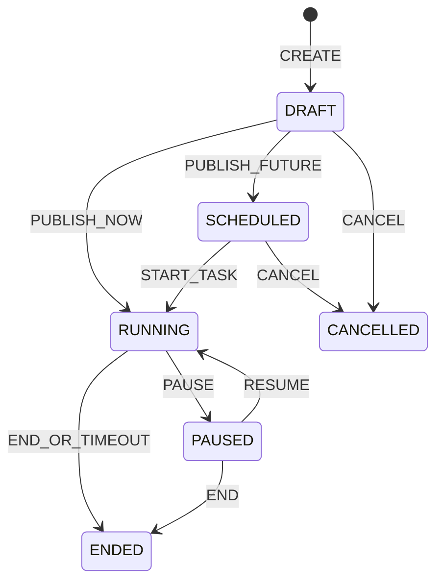
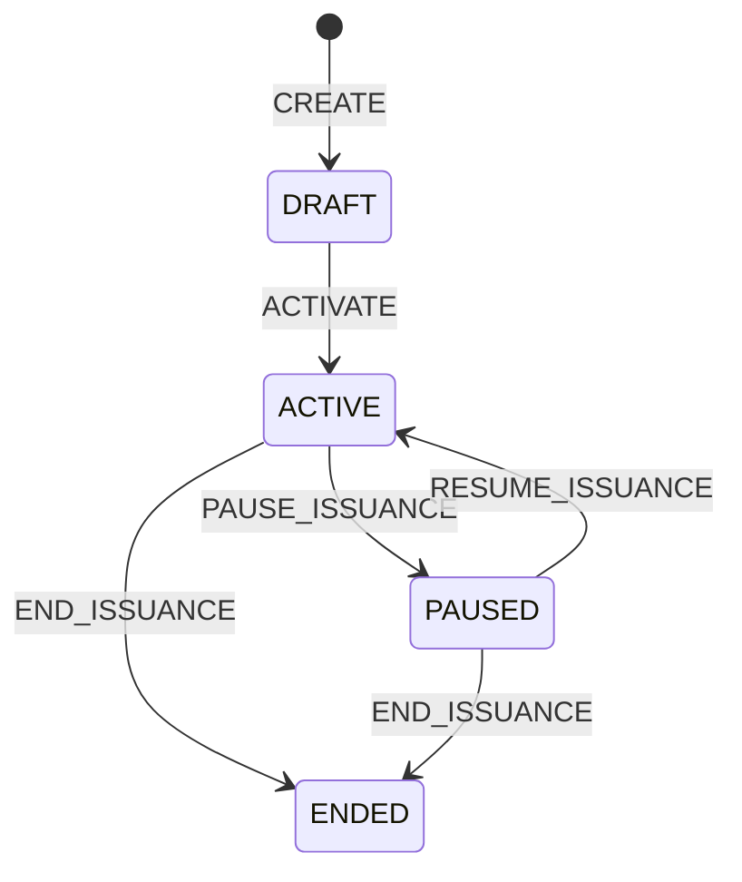
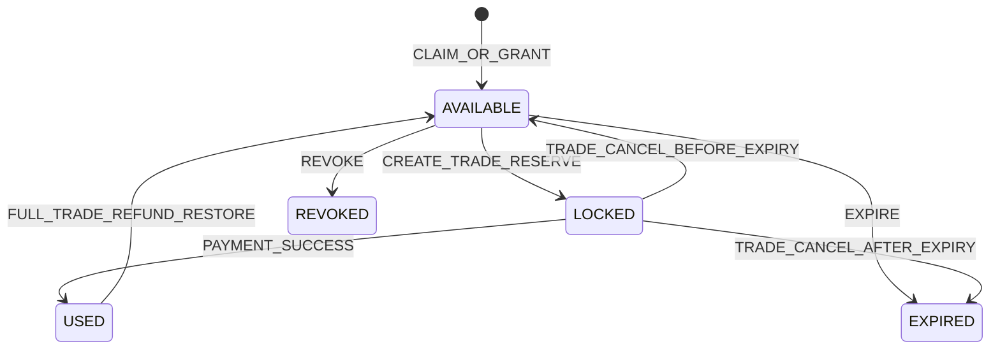

# 时光商城优惠券与限时领券模块产品需求

## 1. 文档定位

本文定义时光商城优惠券领域的完整产品规则，覆盖平台券、店铺券、百分比减免、满减券、零门槛红包、领券中心、限时抢券、兑换码、定向发券、结算选券、核销、退款返券、营销预算和运营治理。

本模块是现有交易体系之上的独立增量，不回写或替换已有产品分册。实施前必须同时阅读：

- [产品调研与业务范围](product-research-and-scope.md)：多商户、角色和范围边界。
- [基础交易功能分册](phase-1-requirements.md)：购物车、跨店父交易、子订单、支付和履约。
- [治理与售后功能分册](phase-2-requirements.md)：RBAC、售后额度、退款和自动任务。
- [优惠券数据库设计](../database/coupon-design.md)：表、金额快照、分摊、状态和锁顺序。
- [优惠券 API 设计](../api/coupon-api.md)：路径、DTO、错误码、幂等和兼容字段。
- [优惠券实现、运营、权限与风控规范](../development/coupon-implementation-and-operations.md)：角色职责、工程边界、运营指标、风控和排障。

优惠券增量启用前，原有“无优惠”业务语义保持不变；启用后，未选择优惠券的交易金额也必须与旧版本完全一致。

## 2. 目标与边界

### 2.1 产品目标

1. 买家能快速理解“能不能领、能不能用、能省多少、为什么不能用”，结算时默认获得最优方案，同时保留手动选择权。
2. 商家能创建只作用于本店的优惠券和活动，控制发放量、有效期、适用商品、单用户限领和成本上限。
3. 平台能创建跨店平台券、零门槛红包和新客券，并可治理违规店铺活动。
4. 限时抢券在高并发下不超发，同一用户重复点击或网络重试不重复领券。
5. 优惠核销、订单金额、买家退款和商家结算使用同一份明细级分摊快照，任何一分钱都能追溯。
6. 模块通过新增领域表和增量字段接入，不复用订单状态、钱包流水类型或售后字段表达优惠券状态。

### 2.2 明确不做

以下能力不属于本模块，不能借优惠券字段临时实现：

| 能力 | 说明 |
| --- | --- |
| 积分、成长值、会员等级 | 需要独立会员与积分账本 |
| 秒杀商品价、预售、拼团、买赠、N 元任选 | 属于商品促销和特殊交易，不是优惠券 |
| 运费券 | 当前运费统一为 `0.00`，没有运费模板和物流计价基础 |
| 礼品卡、储值卡 | 具有余额和多次消费属性，应使用独立资金账户 |
| 券转赠、交易和提现 | 用户券只允许本人使用，不具有现金价值 |
| 随机金额红包 | 会增加概率、奖池、公示和审计要求；零门槛红包金额固定 |
| 线下核销 | 当前只有线上订单和钱包支付 |
| 自动改价或店铺级满减 | 本模块只在用户明确使用已领取优惠券时优惠，不创建无券促销规则 |

## 3. 核心概念

| 概念 | 定义 |
| --- | --- |
| 优惠券活动 `coupon_activity` | 面向用户展示和组织发放的活动，例如“开学抢券日”；一个活动可包含多张券模板 |
| 券模板 `coupon_template` | 定义券种、面额、门槛、适用范围、有效期、发行量、资金承担和叠加策略；开始发券后经济规则不可修改 |
| 用户券 `user_coupon` | 某名用户实际持有的一张券实例，具有独立券号、有效期和状态 |
| 领取记录 `coupon_claim_record` | 用户券因公开领取、限时抢券、兑换码、定向发放或系统事件而产生的审计记录 |
| 核销记录 `coupon_redemption` | 用户券对某张父交易的一次预占、支付核销、释放或退款返还过程 |
| 核销分摊 `coupon_redemption_allocation` | 一张券优惠金额在子订单和订单明细上的精确分摊，也是退款与商家结算依据 |
| 发行量 | 模板生命周期内最多能产生的用户券数量；已过期、已使用或撤销的券不返还发行量 |
| 活动库存 | 当前还可领取的发行名额，不是商品库存，不得写入 `inventory_stock` |
| 优惠预算 | 对实际优惠金额的风险上限和台账，不是买家或商家钱包余额 |

“活动库存”“商品库存”“用户券状态”和“营销预算”是四个不同概念，接口和页面不得混用“库存不足”一个文案。

## 4. 参与角色

| 角色 | 核心能力 | 数据范围 |
| --- | --- | --- |
| 普通用户 `CUSTOMER` | 查看活动、领券、兑换、管理我的券、结算选券、查看核销结果 | 仅本人用户券和本人交易 |
| 店铺管理员 `SHOP_ADMIN` | 管理本店券模板、活动、定向发券、数据报表 | 仅路径 `shopId` 对应店铺 |
| 店铺营销运营（建议新增） | 创建、发布、暂停本店活动和券模板 | 仅所属店铺；由店铺自定义角色承载新权限 |
| 平台优惠券运营（建议新增） | 创建平台券、平台活动、定向发券、兑换码和全局报表 | 平台作用域 |
| 平台优惠券治理人员 | 暂停违规店铺活动、撤销未使用券、查看完整审计 | 平台作用域，只做治理动作，不冒充店铺编辑 |
| 超级管理员 `SUPER_ADMIN` | 配置角色和权限，可被授予平台优惠券权限 | 不自动获得店铺接口数据范围 |

平台人员不能通过平台权限调用店铺路径创建“商家自发券”；店铺人员也不能创建跨店平台券。平台治理暂停店铺活动是独立平台动作，不等于平台成为店铺成员。

## 5. 券种设计

### 5.1 稳定券种代码

| `couponType` | 中文名称 | 规则 | 示例 |
| --- | --- | --- | --- |
| `PERCENTAGE` | 百分比减免券 | 达到可选门槛后，按有效计算基数的 `percentageOff` 百分比减免，并受 `maximumDiscountAmount` 上限约束 | `percentageOff=10.00` 表示减 10%，等价于用户常说的 9 折 |
| `THRESHOLD_REDUCTION` | 满减券 | 有效商品原始金额达到 `thresholdAmount` 后减固定 `discountAmount` | 满 200 减 30 |
| `CASH_RED_PACKET` | 零门槛红包 | `thresholdAmount` 固定为 `0.00`，减固定 `discountAmount` | 无门槛减 5 元 |

百分比字段统一表示“减免百分比”，不是折后比例：

```text
percentageOff = 10.00  -> 减 10% -> 用户支付约 90%
percentageOff = 25.00  -> 减 25% -> 用户支付约 75%
```

页面可以展示“9 折”，但请求、数据库和金额引擎只使用 `percentageOff=10.00`，禁止把 `0.9`、`9`、`90` 混作同一语义。

### 5.2 规则约束

| 券种 | 门槛 | 优惠字段 | 必要约束 |
| --- | --- | --- | --- |
| `PERCENTAGE` | `thresholdAmount >= 0.00` | `0.01 <= percentageOff <= 99.99`；`maximumDiscountAmount > 0.00` | 必须设置最高减免额，避免预算无限暴露 |
| `THRESHOLD_REDUCTION` | `thresholdAmount > 0.00` | `discountAmount > 0.00` | `discountAmount < thresholdAmount` |
| `CASH_RED_PACKET` | 固定 `0.00` | `discountAmount > 0.00` | 不设置百分比或最高减免额 |

任何叠加组合都不能让任一订单明细或店铺子订单的应付金额低于 `0.01`。当固定红包大于可优惠金额时，实际优惠取可用上限，未使用面额不结转、不找零，用户确认前必须看到“本单实际抵扣”和“未用面额将失效”。

## 6. 归属、资金承担与适用范围

### 6.1 券归属

| `ownerType` | 含义 | 能力边界 |
| --- | --- | --- |
| `PLATFORM` | 平台券 | 可跨店或限定多个店铺、类目、SPU、SKU |
| `SHOP` | 店铺券 | `ownerShopId` 必填，只能作用于该店铺内的商品 |

券的归属决定谁能管理，不直接决定谁承担优惠成本。

### 6.2 资金承担

| `fundingType` | 平台承担比例 | 商家承担比例 | 使用场景 |
| --- | ---: | ---: | --- |
| `PLATFORM` | 100% | 0% | 平台红包、平台拉新券 |
| `SHOP` | 0% | 100% | 店铺自行促销 |
| `SHARED` | `platformShareRate` | `100% - platformShareRate` | 平台与店铺联合活动 |

规则：

1. 店铺券默认且只能选择 `SHOP`；联合活动必须由平台创建，并由每个承担成本的店铺明确接受，店铺不能自行承诺平台补贴。
2. 平台券可以选择三种资金承担方式；`SHARED` 的 `platformShareRate` 为 `0.0001..99.9999` 的百分比数。
3. 每次优惠在订单明细层拆成 `platformFundedAmount` 和 `shopFundedAmount`，两者之和必须等于该明细优惠金额。
4. 平台承担部分计入商家应收补贴；商家承担部分直接降低商家结算基数。买家只关心总优惠，不展示内部补贴比例。
5. `SHARED` 只允许平台券使用 `SHOP`/`SPU`/`SKU` 范围，确保所有承担成本的店铺可以被完整列出；不允许全平台或开放类目范围。
6. 每个受影响店铺必须由拥有 `shop:coupon:funding:approve` 的成员明确接受承担比例，全部接受后模板才能激活。平台不能代替商家接受，也不能在第一张券发行后改变比例或参与店铺。

### 6.3 适用范围

| `scopeType` | 含义 | 规则 |
| --- | --- | --- |
| `ALL` | 全部可购买商品 | 平台券表示全平台；店铺券表示本店全部可购买商品 |
| `SHOP` | 指定店铺 | 只允许平台券，可配置一个或多个店铺 |
| `CATEGORY` | 指定类目 | 包含所选类目及其启用后代叶子类目 |
| `SPU` | 指定商品 | 可配置一个或多个 SPU |
| `SKU` | 指定销售规格 | 可配置一个或多个 SKU |

一个模板只能选择一种 `scopeType`，不能同时使用“类目 + 指定 SKU”形成隐式并集。若运营需要不同范围，应拆成两个模板，以便用户解释、预算和数据分析保持清晰。

店铺券选择 `CATEGORY` 时，只命中本店该类目商品；选择 `SPU` 或 `SKU` 时，目标必须属于 `ownerShopId`。目标商品后续下架、禁售、删除或 SKU 停用时自然不再可购买，但已领取的券不因此自动撤销。

## 7. 发放方式与人群

### 7.1 发放方式

| `distributionType` | 用户入口 | 说明 |
| --- | --- | --- |
| `PUBLIC_CLAIM` | 领券中心、商品详情或店铺页 | 在领取时间窗内主动领取 |
| `FLASH_CLAIM` | 限时活动页 | 到点开放、名额有限，强调并发和限流 |
| `REDEEM_CODE` | 输入兑换码 | 一码一用；服务端只保存摘要，不保存明文 |
| `DIRECT_GRANT` | 无公开入口 | 平台或店铺按用户列表定向发放 |
| `SYSTEM_GRANT` | 注册事件 | 新用户欢迎券由系统幂等发放 |

一个模板只使用一种发放方式，避免同一发行量被不同渠道以不同限领规则竞争。活动可包含多个模板，但模板只能归属一个活动。无活动模板可以用于 `DIRECT_GRANT`、`SYSTEM_GRANT` 或 `REDEEM_CODE`；`PUBLIC_CLAIM` 和 `FLASH_CLAIM` 必须归属于活动，且 `FLASH_CLAIM` 必须归属于 `activityType=FLASH_CLAIM` 的活动。

### 7.2 适用人群

| `audienceType` | 资格定义 |
| --- | --- |
| `ALL_USERS` | 所有状态有效的登录用户 |
| `NEW_USERS` | 领取时账号注册时间在配置的 `newUserWithinDays` 内；使用时仍需在券有效期内，不重复检查注册窗口 |
| `FIRST_ORDER_USERS` | 领取和使用时均不存在成功支付的父交易；一旦完成首单支付，其他同类首单券变为不可用 |
| `SPECIFIED_USERS` | 当前版本只允许定向发放，公开领取、兑换码和系统注册发放均不可用 |

用户账号必须为 `ACTIVE` 且未删除。平台/店铺成员身份不会自动获得消费者领券资格；同一个登录账号只要拥有 `CUSTOMER` 权限并符合人群规则即可作为买家使用。

### 7.3 数量限制

- `totalIssueLimit`：模板总发行量，必须为正整数；开始发券后只能增加，不能减少到已发行量以下。
- `perUserLimit`：同一模板每名用户最多获得的用户券数量，范围 `1..99`。
- 活动页展示 `remainingQuantity` 时，超过配置阈值可返回模糊文案“库存充足”，避免高频精确库存探测；最后少量可返回精确值。
- 已发行券无论使用、过期还是撤销，都不恢复发行量。预支付释放恢复的是用户券可用状态，不是模板发行量。

## 8. 有效期

| `validityType` | 规则 |
| --- | --- |
| `FIXED_RANGE` | 模板设置固定 `validFrom` 和 `validTo`；领取后的用户券使用同一时间窗 |
| `RELATIVE_AFTER_CLAIM` | 用户券从领取后 `effectiveDelayMinutes` 分钟生效，持续 `validForHours` 小时 |

统一规则：

1. 时间均按 `Asia/Shanghai` 解释，API 带 `+08:00` 偏移。
2. 有效区间为 `[validFrom, validTo)`：等于 `validFrom` 可用，等于 `validTo` 已过期。
3. `FIXED_RANGE` 的 `validTo` 必须晚于领取结束时间，至少留出 1 小时使用时间。
4. `RELATIVE_AFTER_CLAIM` 的 `validForHours` 为 `1..8760`，`effectiveDelayMinutes` 为 `0..10080`。
5. 用户券创建时固化最终 `validFrom/validTo`；模板或活动之后暂停，不改变已领取券的有效期。
6. 查询时以当前时间实时判断过期，不能依赖过期任务是否已经更新数据库状态。

## 9. 活动生命周期

### 9.1 活动类型

| `activityType` | 用途 |
| --- | --- |
| `COUPON_CENTER` | 常规领券中心、店铺领券专区 |
| `FLASH_CLAIM` | 明确开始和结束时间的限时抢券活动 |
| `NEW_USER_WELCOME` | 新用户欢迎券集合，通常配合系统发放或新客领取 |
| `TARGETED_CAMPAIGN` | 定向用户、兑换码或运营批量发放的活动容器 |

### 9.2 状态机



状态规则：

- `DRAFT` 可编辑活动和未发行模板。
- `SCHEDULED` 已冻结经济规则，等待开始；允许取消，不允许修改券面值、范围和资金承担。
- `RUNNING` 接受领取；活动暂停只阻止新领取，已领取券仍按券有效期使用。
- `PAUSED` 可由运营主动暂停或平台治理暂停；恢复不得延长原结束时间。
- `ENDED`、`CANCELLED` 为终态；`CANCELLED` 只允许尚未开始的活动。
- 自动开始/结束任务只是状态推进器；领取接口仍必须实时校验时间窗，不能因任务延迟多发一张券。

## 10. 券模板生命周期与不可变规则

券模板状态使用 `DRAFT`、`ACTIVE`、`PAUSED`、`ENDED`：



第一张用户券产生后，下列字段永久不可修改：

- `couponType` 及金额规则；
- `ownerType`、`ownerShopId`、`fundingType`、平台承担比例；
- `scopeType` 和所有范围目标；
- `validityType` 及有效期参数；
- `distributionType`、`audienceType`、单用户限领；
- 叠加策略和退款返券策略。

仍允许修改不影响用户权益的展示信息，例如标题、副标题、使用说明和排序；修改必须写操作日志。若经济规则错误，应暂停旧模板并创建新模板，不能修改后让已领取券的权利发生变化。

## 11. 领券与抢券流程

### 11.1 普通领取

1. 用户打开活动详情，服务端返回模板、可领取状态和不可领取原因。
2. 用户点击领取，客户端生成新的 `Idempotency-Key`；网络重试沿用同一个 Key。
3. 服务端校验登录状态、活动/模板状态、领取时间、人群、单用户限领、总发行量和风控限制。
4. 服务端原子增加模板已发行量，创建用户券和领取记录。
5. 返回用户券和最终有效期；重复请求返回第一次结果，不产生第二张券。

### 11.2 限时抢券

限时抢券与普通领取使用同一数据模型，但增加以下规则：

- 活动未开始返回明确的 `startsAt`，前端显示服务端时间校准后的倒计时。
- 到点前请求不能提前占位；到点后以数据库条件更新的成功顺序为准。
- Redis 可以用于限流、热点剩余量缓存和快速失败，但数据库 `issued_count < total_issue_limit` 条件更新及唯一约束是最终防超发保护。
- 同一用户、同一模板的并发请求按用户限领约束只成功规定数量；失败请求不得扣减发行量。
- 售罄返回 `COUPON_SOLD_OUT`，不能返回通用 `INVENTORY_INSUFFICIENT`。
- 不设置“排队中但结果未知”的长期状态；当前教学商城同步返回领取成功或失败，避免用户反复等待。

### 11.3 兑换码

- 兑换码为一次性随机高熵字符串，区分大小写；页面去除首尾空白但不改变中间字符。
- 数据库只保存 `HMAC-SHA-256(serverSecret, normalizedCode)` 和密钥版本，服务端密钥不入库；创建批次后明文只在创建响应中返回一次。
- 兑换成功后代码状态变为 `REDEEMED` 并关联用户券；相同代码不能被第二名用户使用。
- 输入错误统一返回 `COUPON_CODE_INVALID`，不暴露代码不存在、已撤销或属于其他活动的内部差异；本人已经成功兑换同一码时幂等返回原用户券。

### 11.4 系统事件发放

当前版本的 `SYSTEM_GRANT` 只实现 `USER_REGISTERED` 事件，主要用于新用户欢迎券。模板必须为平台模板、`distributionType=SYSTEM_GRANT`、`audienceType=NEW_USERS`；可以属于 `NEW_USER_WELCOME` 活动，也可以不属于活动。店铺若要触达新客，应使用公开新客券或有依据的 `DIRECT_GRANT`，不能订阅全平台注册事件。其他事件（例如支付成功、售后完成）不能借用该枚举，待未来定义独立事件契约后再扩展。

发放时序和失败隔离如下：

1. 用户注册事务提交成功后发布内部 `USER_REGISTERED` 领域事件，事件包含不可变 `eventId`、`userId`、`registeredAt`；优惠券处理器异步消费，注册接口不等待营销处理。
2. 系统任务每分钟扫描仍在新客窗口内的有效 `SYSTEM_GRANT` 模板和已注册用户，使用同一业务键补偿事件投递、消费失败或服务重启造成的遗漏。扫描必须分页并按 `userId ASC, templateId ASC` 稳定排序。
3. 每个“用户 + 模板 + `USER_REGISTERED` 事件”最多发一张券，幂等键固定为 `SYSTEM_GRANT:USER_REGISTERED:{userId}:{templateId}`；重复事件、重复扫描和重试都返回原领取结果，不增加发行量。
4. 事件处理失败只记录失败原因、重试次数和请求链路，进入下一轮重试或告警；不得回滚用户注册事务，也不得让注册接口返回优惠券内部错误。
5. 模板在扫描时仍需实时校验状态、发行量、预算和新客资格。无活动模板在自身 `ACTIVE` 时可发放；有关联活动时，活动必须为当前可运行状态且处于时间窗内。活动暂停、结束或取消只停止后续发放，已经创建的用户券继续按固化有效期使用。

## 12. 用户券状态

| 状态 | 含义 | 可执行动作 |
| --- | --- | --- |
| `AVAILABLE` | 已领取且当前未被订单占用 | 在有效期和资格满足时选择使用 |
| `LOCKED` | 已被一张待支付父交易预占 | 只能随该交易支付核销或取消释放 |
| `USED` | 对成功支付交易完成核销 | 只读；满足全单退款返券政策时可恢复 |
| `EXPIRED` | 已到 `validTo` 且未使用 | 只读 |
| `REVOKED` | 因作弊、误发或治理原因撤销 | 只读；必须有操作者和原因 |



`LOCKED` 不是已使用。支付失败但父交易仍可重试时，券继续锁定在该父交易；用户取消或父交易超时后立即释放。只要券在有效期内成功锁定，就允许在该父交易 `payExpireAt` 前完成支付，即使期间已超过券 `validTo`；它不能再用于新交易，取消时若已过期则直接进入 `EXPIRED`。

## 13. 结算选券体验

### 13.1 可用与不可用列表

结算预览必须同时返回：

- 当前可用券及每张券预计优惠；
- 默认推荐组合及总优惠；
- 当前不可用但与本次结算相关的券，以及稳定原因代码；
- 距离门槛还差的金额，例如“再购 20.00 元可用”；
- 固定红包面额大于实际可抵扣时的未使用面额提示；
- 优惠前金额、优惠金额、应付金额和各店铺分组金额。

与当前结算完全无关的券无需返回，避免列表过长。例如仅适用于另一店铺的券可归入“其他不可用券”分页查看，不必占据当前选券面板。

### 13.2 自动推荐

默认 `AUTO` 模式枚举所有合法组合，选择买家总优惠最大的组合。并列时按以下顺序确定唯一结果：

1. 使用券数量更少；
2. 最早过期的用户券优先；
3. 最早领取的用户券优先；
4. 用户券 ID 升序。

推荐算法必须确定性执行，同一商品、价格、库存、用户券和时间快照得到相同结果。前端不能自行估算“最优券”后只把金额提交给后端。

### 13.3 手动选择与不使用

- `MANUAL`：用户明确勾选券；非法组合即时解释，不静默替换成其他券。
- `NONE`：用户明确不使用优惠券；后端不得自动加券。
- 用户选择结果通过短期 `couponQuoteToken` 带到正式下单。Token 只证明预览上下文，不锁价、不锁库存、不锁券。
- 正式下单必须重新读取价格、商品状态、库存、券状态和时间。如果结果变化，整个下单失败并返回刷新原因，不能偷偷少优惠后继续创建交易。

## 14. 叠加规则与计算顺序

### 14.1 允许的组合

一张跨店父交易最多使用：

- 1 张平台券；
- 每张店铺子订单最多 1 张该店铺券；
- 因而跨三家店的交易理论上最多使用 1 张平台券和 3 张店铺券。

同一店铺不能同时使用两张店铺券，同一父交易不能同时使用两张平台券。平台券与店铺券只有在二者 `stackMode=CROSS_OWNER` 时才可叠加；任一券为 `EXCLUSIVE` 时，重叠商品上不能再叠加另一张券。

不同店铺的店铺券互不重叠，可以同时使用。

### 14.2 门槛口径

```text
eligibleGrossAmount = SUM(命中范围的订单明细 originalAmount)
```

- 门槛只计算商品原始金额，不含运费。
- 门槛不扣除其他券优惠，避免叠加后“先满足又突然不满足”。
- 数量按当前结算数量计算；商品当前销售价由后端实时读取。
- 平台券跨店汇总所有命中明细；店铺券只汇总所属子订单命中明细。

### 14.3 优惠计算顺序

1. 校验每张券在原始金额口径下独立满足门槛。
2. 先计算并分摊各店铺券。
3. 再计算平台券；平台券的百分比或固定抵扣基数为命中明细扣除已分摊店铺券后的剩余金额。
4. 所有优惠都受“每条订单明细、每张子订单至少应付 `0.01`”和券自身上限约束。
5. 汇总到明细、子订单和父交易，校验每层金额等式。

券种公式：

```text
PERCENTAGE:
rawDiscount = calculationBase * percentageOff / 100
discount = MIN(roundHalfUp(rawDiscount, 2), maximumDiscountAmount, remainingPayableCap)

THRESHOLD_REDUCTION / CASH_RED_PACKET:
discount = MIN(discountAmount, remainingPayableCap)
```

### 14.4 分摊规则

每张券在其命中明细间按计算基数比例分摊：

1. 全部金额转成“分”计算。
2. 计算高精度理论分摊并向下取整。
3. 剩余的分按小数余数从大到小逐分分配。
4. 余数相同时按 `(shopId, skuId, cartItemId)` 升序。
5. 资金承担金额在优惠分摊后再次使用同样方法拆成平台承担与商家承担。

分摊结果创建交易时固化，支付、售后、退款和结算不得重新按当前模板计算。

### 14.5 示例

用户购买：

- A 店商品 240.00 元，使用 A 店满 200 减 30；
- B 店商品 100.00 元；
- 平台券减 10%，最高减 50，可跨店并允许叠加。

计算：

```text
A 店券：240.00 - 30.00 = 210.00
平台券基数：210.00 + 100.00 = 310.00
平台券优惠：MIN(31.00, 50.00) = 31.00
总优惠：30.00 + 31.00 = 61.00
父交易应付：340.00 - 61.00 = 279.00
```

平台券的 31.00 再按 A 店 210 与 B 店 100 的比例分摊到明细，所有分摊之和必须恰好为 31.00。

## 15. 下单、支付、取消与核销

### 15.1 创建父交易

正式下单在一个事务中完成：

1. 重新校验商品、价格、店铺和库存。
2. 重新校验用户券归属、状态、有效期、人群、范围、门槛和叠加关系。
3. 计算唯一优惠结果和明细分摊。
4. 预占商品库存。
5. 将用户券 `AVAILABLE -> LOCKED`，创建 `RESERVED` 核销记录。
6. 创建父交易、子订单、订单明细及优惠金额快照。
7. 写核销分摊和审计记录；用户券从 `AVAILABLE -> LOCKED` 不改变模板预算预占，最大责任已在发券时预占。

任何一步失败，商品库存、券状态、核销/分摊和订单全部回滚。

使用任一 `FIRST_ORDER_USERS` 券时，同一用户最多只能存在一张此类待支付父交易。并发创建由数据库唯一保护；如果已有一张，返回现有交易提示，不能再锁第二组首单券。

### 15.2 支付成功

- 支付金额等于父交易优惠后 `payableAmount`，客户端仍不能提交金额。
- 使用首单券的交易在锁定买家钱包后、扣款前再次检查没有其他成功支付父交易；若资格被另一笔无券交易先占用，本次支付失败，用户需取消并重新结算。
- 支付成功事务将所有关联用户券 `LOCKED -> USED`，核销记录 `RESERVED -> CONSUMED`。
- 平台补贴、商家承担和商家钱包结算依据下单时分摊快照入账。
- 支付成功后不能更换或移除优惠券。

### 15.3 支付失败、主动取消与超时

- 某次支付尝试失败但父交易仍为 `PENDING_PAYMENT`：券继续锁定，允许用户再次支付。
- 用户主动取消或父交易超时：核销记录变为 `RELEASED`；用户券若尚未过期恢复 `AVAILABLE`，否则变为 `EXPIRED`。
- 释放本次交易的券核销预占；用户券恢复可用时，模板仍保留该券的最大预算责任。只有券最终过期或被撤销才释放模板预算；模板发行量始终不减少。
- 取消任务重复执行不得重复释放券或预算。

## 16. 售后退款与返券

### 16.1 买家退款金额

优惠券不作为现金退给买家。每条订单明细的可退金额基于优惠后实际应付金额：

```text
itemPayableAmount = originalAmount + freightAmount - couponDiscountAmount

累计数量退款上限 = FLOOR(itemPayable分数 * 累计退款数量 / 购买数量)
本次可退上限 = 新累计上限 - 已成功退款金额
```

因此部分退款不会把已享受的券优惠另行退入钱包，也不会按商品原价退款。

### 16.2 返券政策

模板使用稳定 `refundRestorePolicy`：

| 代码 | 规则 |
| --- | --- |
| `NEVER` | 支付核销后任何退款都不返券 |
| `FULL_TRADE_ONLY` | 父交易下全部子订单和全部明细均已全额退款后返券一次 |

默认使用 `FULL_TRADE_ONLY`，具体规则：

1. 部分退款、单个子订单全退但父交易仍有其他未退订单，均不返券。
2. 返券只在全父交易退款成功事务完成后执行；退款处理中或失败时不提前返。
3. 同一用户券最多因退款恢复一次，`restoreCount` 最大为 1；恢复后再次使用又全退，不再恢复，防止循环套利。
4. 模板或券因风控撤销时不恢复。
5. 恢复时有效期取 `MAX(原 validTo, restoredAt + 72 小时)`，称为返券宽限期；页面明确展示新的截止时间。
6. 原券为 `FIRST_ORDER_USERS` 且用户已经存在其他成功支付交易时不恢复，记录稳定原因 `AUDIENCE_NO_LONGER_ELIGIBLE`。
7. 一张父交易使用多张券时，每张券独立判断，但“全父交易退款”条件相同。

### 16.3 商家结算冲回

- 商家承担的优惠从未计入商家应收，不在退款时二次扣除。
- 平台补贴在支付时计入商家应收；退款对应明细时按原分摊冲回平台补贴。
- 商家资金冲回金额等于“买家实际退款 + 被冲回的平台补贴 - 可退佣金”。
- 所有金额使用原订单分摊，不按退款时券模板或补贴比例重新计算。

## 17. 撤销、暂停与治理

### 17.1 暂停发放

运营暂停活动或模板只阻止新领取：

- 已领取 `AVAILABLE` 券仍可使用；
- 已锁定券仍可随原交易支付；
- 已使用券和订单金额不变。

### 17.2 撤销用户券

撤销是高风险治理动作，只允许 `AVAILABLE` 券：

- 必须记录原因、操作者和来源工单号或说明；
- `LOCKED` 券不能直接撤销，应先处理或取消关联交易；
- `USED` 券不能撤销，必须通过订单售后和资金流程处理；
- 批量撤销必须逐张记录结果，部分失败不能伪装成全部成功；
- 运营配置错误原则上暂停模板并补发正确券，不应损害用户已领取权益。

### 17.3 店铺状态联动

| 店铺状态 | 创建/编辑草稿 | 发布/领取 | 已领取券使用 | 历史查询 |
| --- | --- | --- | --- | --- |
| `PENDING` | 允许草稿 | 不允许 | 无新增使用 | 允许 |
| `ACTIVE` | 允许 | 允许 | 允许 | 允许 |
| `SUSPENDED` | 允许整改 | 暂停新领取 | 只要商品不可购买，自然无法新下单；历史交易不变 | 允许 |
| `CLOSED` | 不允许 | 不允许 | 不允许新使用 | 只读 |

店铺关闭检查必须把 `RUNNING`/`PAUSED` 活动、尚未结束模板和 `LOCKED` 用户券视为活跃营销业务；关闭前应结束发放并处理待支付交易，避免留下无法释放的券预占。

## 18. 页面与交互要求

### 18.1 买家端

| 页面 | 必须展示 | 主要操作 |
| --- | --- | --- |
| 领券中心 | 活动、券面利益、门槛、适用范围、有效期、是否已领、剩余状态 | 领取、查看规则 |
| 限时抢券页 | 服务端校准倒计时、开始/结束、已领/售罄状态 | 到点领取 |
| 兑换码弹窗 | 单个输入框、统一结果 | 兑换 |
| 我的优惠券 | 可用、使用中、已使用、已过期/已撤销分组；券号、来源和到期时间 | 查看可用商品、去使用 |
| 结算选券 | 推荐组合、可用/不可用券、原因、差额、优惠前后金额 | 自动、手动、不使用 |
| 订单详情 | 优惠总额、所用券、各明细优惠后应付 | 查看优惠明细 |
| 售后资格 | 商品实付、已退和可退上限 | 按优惠后金额申请 |

按钮不得在请求未完成时制造第二次用户动作；客户端禁用按钮只改善体验，幂等仍由服务端保证。

### 18.2 商家端

| 页面 | 必须展示 | 主要操作 |
| --- | --- | --- |
| 券模板列表 | 类型、利益、范围、有效期、发行/领取/核销、状态、预算 | 创建、复制、暂停、结束 |
| 活动管理 | 活动时间、渠道、模板、状态、领取进度 | 发布、暂停、恢复、结束 |
| 范围选择器 | 本店类目、SPU、SKU，带当前上下架状态 | 添加/移除草稿范围 |
| 定向发券 | 模板、用户列表、成功/失败明细 | 幂等发放 |
| 优惠订单 | 订单号、券号、优惠、店铺承担、平台补贴、退款冲回 | 筛选、查看 |
| 效果报表 | 发行、领取、核销、优惠成本、带动成交 | 按活动/模板/时间筛选 |

### 18.3 平台端

平台端除平台券和全局活动管理外，还需提供店铺活动治理、跨店核销检索、资金承担审计、异常预占和预算对账。只读运营人员不能发布、撤销或定向发券。

## 19. 通知与可解释性

当前系统没有通用买家站内信，本模块不复用 `merchant_notification` 给买家发送优惠券通知。用户权益变化通过以下入口可见：

- 领券动作即时结果；
- “我的优惠券”状态和状态原因；
- 结算不可用原因；
- 订单优惠明细；
- 全额退款完成后的返券结果。

后续接入站内信时，应消费 `COUPON_CLAIMED`、`COUPON_EXPIRING`、`COUPON_RESTORED` 等领域事件，不得在优惠券事务中同步调用不可靠外部通知服务。

## 20. 非功能与风控要求

| 类别 | 要求 |
| --- | --- |
| 并发 | 抢券不超发；同一券不能被两张待支付交易同时锁定；支付和取消竞态只能有一个最终结果 |
| 幂等 | 领取、兑换、定向发券、创建交易、状态动作、撤销和批量操作均按接口要求幂等 |
| 性能 | 活动、模板、用户券、核销和报表全部分页；结算选券只扫描本人候选券，不全表计算 |
| 可解释 | 每个不可领取/不可使用结果有稳定原因代码和必要差额，不只返回 `false` |
| 审计 | 经济规则、范围、状态、发券、撤销、预占、核销、释放、返券和资金承担均可追溯 |
| 风控 | 用户/模板/IP 或设备维度限流只作为辅助；账号、人群、限领、发行量和唯一约束是最终规则 |
| 隐私 | 报表默认只显示用户摘要；不保存明文兑换码，不在日志记录完整兑换码或 Token |
| 一致性 | Redis 不作为券库存或券状态最终事实；数据库状态、唯一键和金额快照是权威 |
| 可恢复 | 定时任务可释放孤立预占、推进过期状态和报告对账差异，但不无审计修改金额 |

## 21. 验收场景

1. 平台创建满 200 减 30 的全平台券，用户领取后在跨店结算中满足门槛并正确优惠。
2. 商家创建减 10%、最高减 50 的类目券，只命中本店目标类目及后代商品，不命中其他店同类目商品。
3. 用户领取 5 元零门槛红包，结算商品金额 3 元时实际抵扣 2.99 元，页面事前说明剩余面额不结转。
4. 限时活动 100 张券由 500 个并发请求抢领，最终恰好产生 100 张用户券，不超发、不重复发给超过限领的用户。
5. 同一领取幂等键重试三次返回同一用户券；相同 Key 改用另一模板返回 `IDEMPOTENCY_KEY_REUSED`。
6. 新客券被老用户领取时返回明确原因；首单券用户在另一终端先完成支付后，当前结算重新校验失败。
7. 跨两店交易同时使用两张互不重叠的店铺券和一张可叠加平台券，计算顺序和明细分摊精确到分。
8. 用户手动选择优惠较少的合法券时，系统尊重选择，不自动换回最优券。
9. 预览后商品价格、券状态或有效期变化，正式下单不静默降优惠，返回刷新结算错误。
10. 一张券被交易 A 锁定后，交易 B 不能使用；A 支付失败但仍待支付时券继续锁定，A 取消后券恢复。
11. 支付和超时取消并发执行时，只能得到 `USED/CONSUMED` 或 `AVAILABLE/RELEASED` 其中一个一致结果。
12. 部分退款只退订单明细优惠后实付金额，不返券，不把优惠金额充值到买家钱包。
13. 父交易全部明细全额退款后，默认策略返券一次并提供至少 72 小时宽限；第二次使用后再全退不循环返券。
14. 平台券由平台承担的部分计入商家应收，退款时按原明细分摊冲回；商家承担部分不会在退款时重复扣除。
15. 活动暂停后不能新领，但已领取券继续可用；错误撤销 `LOCKED` 或 `USED` 券被拒绝。
16. 店铺营销人员无法查看或修改其他店铺模板；`SUPER_ADMIN` 未加入店铺时也不能走店铺接口越权。
17. 模板已发行后尝试修改面额、范围、补贴比例或返券政策返回不可修改错误，复制模板可创建新草稿。
18. 过期任务延迟时，查询和结算仍实时判定已过期；任务补跑不重复写状态或预算流水。
19. 优惠订单、核销分摊、买家退款、商家结算和预算台账可以通过交易号、订单号、用户券号双向追踪。
20. 未选择券的旧客户端仍能完成结算、下单、支付和退款，金额与优惠券模块启用前一致。
21. 新用户注册成功后，即使营销服务短暂失败也不回滚账号；事件重试和补偿扫描最终只为同一用户/模板发一张系统券。

## 22. 完成定义

- 产品、数据库、API、权限和运营文档使用相同枚举、金额公式、状态机和返券政策。
- 增量迁移不回写 `schema.sql`、`schema2.sql` 或 `scheme3.sql`，历史交易回填优惠金额 `0.00` 后通过新约束。
- 领取、抢券、选券、下单、支付、取消、退款和返券均有单元、契约、MySQL 集成和并发测试。
- 所有店铺查询在 SQL 层包含 `shop_id`，平台治理动作使用独立权限和审计。
- 对账可验证模板发行量、用户券、核销记录、订单优惠、资金承担和商家结算之间的等式。
- 前端所有不可用状态都有稳定原因和下一步，不要求用户通过反复提交猜测规则。
